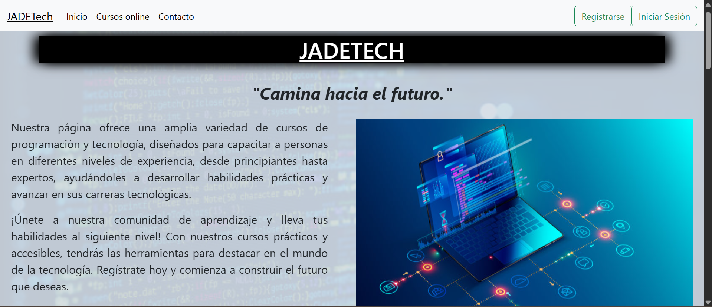
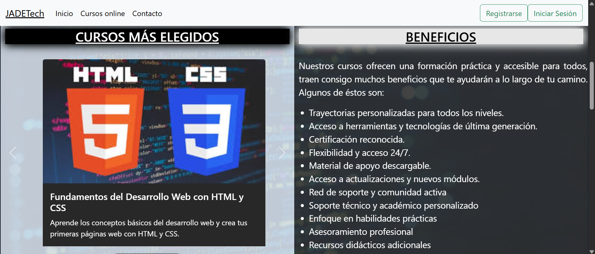
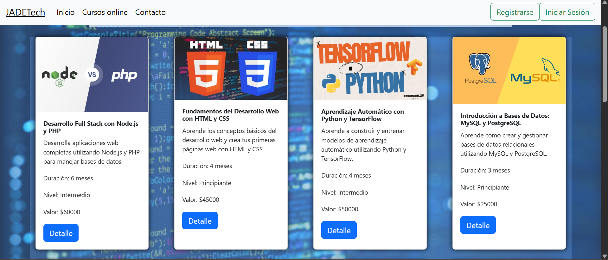
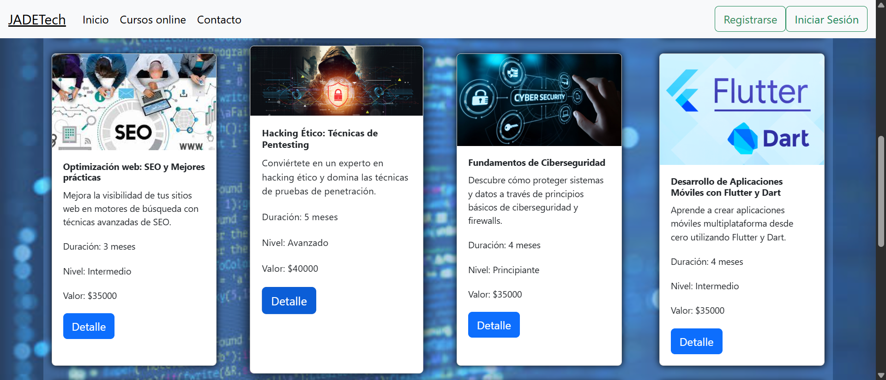
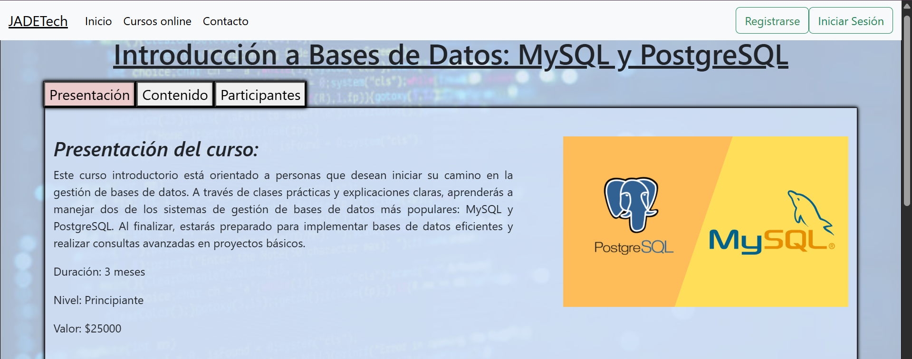
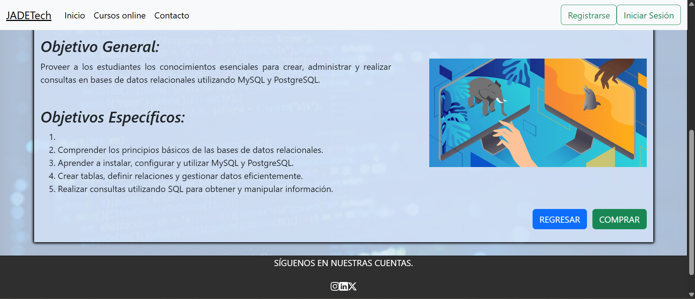
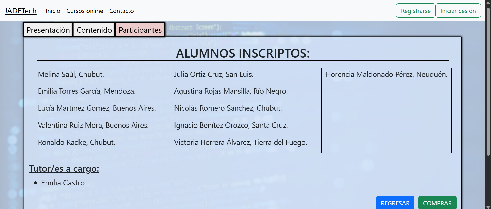
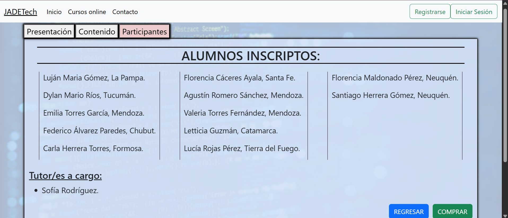

# JADETech - Plataforma de Cursos - 2024

## Descripción

Este proyecto es una **plataforma web de venta y visualización de cursos de informática y tecnología**, desarrollada para ofrecer una experiencia clara y moderna al momento de explorar formaciones disponibles. La plataforma original está basada en **Python**, pero esta versión es solo una representación visual de la misma. La versión publicada funciona como una demostración de portfolio: permite **navegar entre cursos** y **visualizar la información completa de cada uno**, incluyendo su **presentación**, **contenido** y **participantes**. 

Aunque no se incluyen módulos como **login**, **carrito** o un formulario de **contacto**, la aplicación se enfoca en la navegación y consulta de cursos, mostrando un flujo simple y ordenado para recorrer el catálogo y acceder a los detalles de cada curso.

## Características principales

- **Catálogo de cursos:**
  - Listado de cursos disponibles para explorar.
  - Acceso a la vista de detalle de cada curso.

- **Detalle completo por curso:**
  - **Presentación** del curso.
  - **Contenido** (temario / módulos / secciones).
  - **Participantes** registrados en el curso.

- **Datos almacenados en Firebase:**
  - La información de cursos y participantes se obtiene desde **Firebase**.
  - Los participantes son **estáticos** (usuarios de ejemplo creados para simular registros en cursos).

- **Interfaz simple y moderna:**
  - Diseño orientado a la lectura y navegación rápida.
  - Estructura clara para usar como base en proyectos similares.

## Tecnologías utilizadas

- **HTML**
- **CSS**
- **JavaScript**
- **Firebase** (almacenamiento y obtención de datos)

## Estructura del proyecto

La plataforma se compone de una vista principal y vistas de detalle:

1. **INICIO:** Presentación general de la plataforma y acceso al catálogo.
2. **CURSOS DISPONIBLES:** Vista de listado para explorar el catálogo.
3. **DETALLE DE CURSO:** Vista individual por curso con:
   - Presentación
   - Contenido
   - Participantes

## Vista previa

A continuación, se presentan algunas capturas de pantalla del proyecto:

### INICIO

  
  

### CURSOS DISPONIBLES

  
  

### DETALLES DE CURSO - Presentación

  
  

### DETALLES DE CURSO - Participantes

  
  

## Enlace al proyecto

Puedes visitar la versión en vivo del proyecto en el siguiente enlace:  
https://dariang227.github.io/jadetech-cursos/

## Notas adicionales

- Este proyecto fue desarrollado como demostración de portafolio.
- La plataforma no incluye login/carrito/contacto en esta versión.
- Los participantes mostrados son registros estáticos creados con fines de prueba y presentación.

## Autor

Encargado del desarrollo: **Darián Grabano**.  
Ide/s utilizado/s: Visual Studio Code.  
Redes sociales:
- Instagram: https://www.instagram.com/nahuelgra22
- Correo: dariangrabano22@gmail.com
- Facebook: https://www.facebook.com/darian.grabano

Este proyecto fue desarrollado con dedicación y atención al detalle. Si tienes alguna pregunta o sugerencia, no dudes en contactarme. Escríbeme, indícame que vienes por este proyecto y cuéntame lo que necesites.

---

¡Gracias por visitar este proyecto! Espero que lo encuentres interesante y útil.
